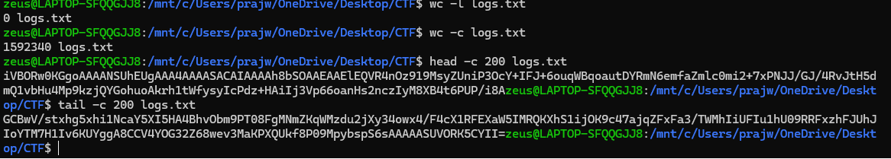
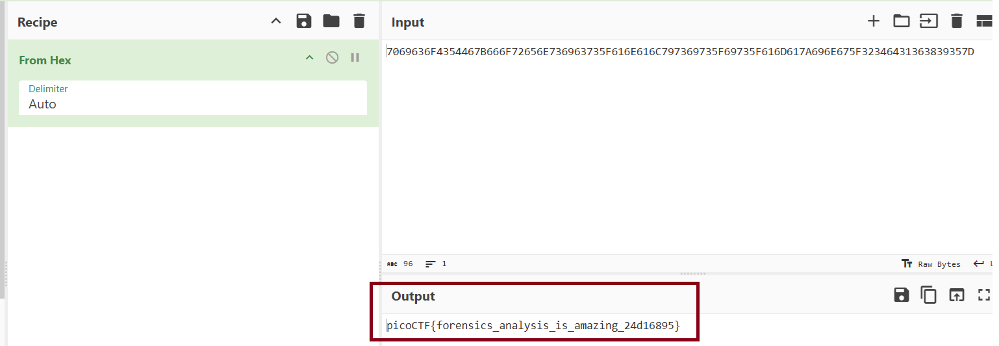

## Disguised Log File

**File:** `logs.txt` (masquerading as a breach log)
**Category:** Forensics File Carving / Data Exfiltration Analysis

### Objective

*"The SOC team discovered a suspiciously large log file after a recent breach. When they opened it, they found an enormous block of encoded text instead of typical logs. Could there be something hidden within? Your mission is to inspect the resulting file and reveal the real purpose of it."*

### Approach

**Step 1 - Inspect the raw structure before decoding anything**

```bash
wc -l logs.txt
wc -c logs.txt
head -c 200 logs.txt
tail -c 200 logs.txt
```



**Findings:**

- `wc -l` = **0** → zero newlines. This confirms it's one giant single line, not multiple log entries which is consistent with an encoded blob rather than real logs.
- `wc -c` = **1,592,340 bytes** → about 1.5MB of encoded text.
- `head -c 200` starts with: `iVBORw0KGgoAAAANSUhEUgAAA4AAAASACAIAAAAh8bSOAAEA...`
- `tail -c 200` ends in `==`

### Identifying the Encoding

The starting sequence `iVBORw0KGgo` is a very recognizable fingerprint it's the **Base64 encoding of a PNG image's magic bytes** (PNG files always start with the same signature bytes, and when Base64-encoded, they always start with `iVBORw0KGgo`). The `==` padding at the end further confirmed valid Base64.

### Decoding

```bash
base64 -d logs.txt > decoded_output
file decoded_output
```

**Output:**

decoded_output: PNG image data, 896 x 1152, 8-bit/color RGB, non-interlaced

Confirmed: that "log file" was never logs at all, it's a PNG image, 896×1152, Base64-encoded and dumped into a `.txt` file to disguise it as text/log data.

```bash
mv decoded_output decoded_output.png
```

### Second Layer Text Embedded in the Image

Opening `decoded_output.png` in an image viewer revealed an illustration with a string baked directly into the image:


Since the text was part of the image itself (not extractable text), I used **Tesseract OCR** to read it:

```bash
tesseract cropped_region.png output.txt
cat output.txt
```

**Extracted string:**
7069636F4354467B666F72656E736963735F616E616C797369735F69735F616D617A696E675F32346431363839357D


### Identifying and Decoding the Hex Layer

This string used only `0-9` and `A-F`  the fingerprint of **hex**, not Base64. I decoded it using CyberChef's **From Hex** operation:



**Output:**
picoCTF{forensics_analysis_is_amazing_24d16895}
