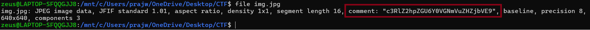
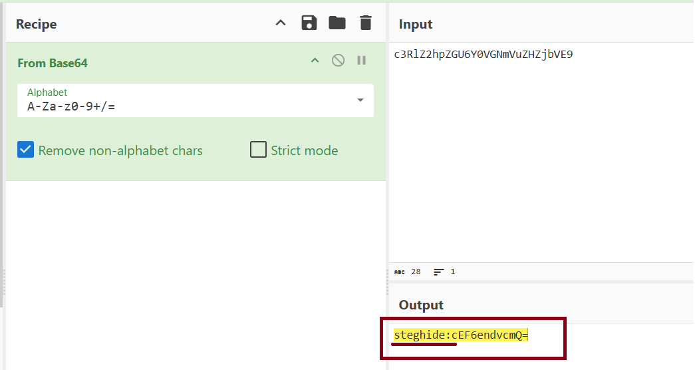
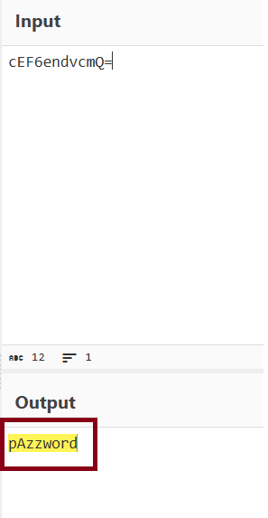

## Image Steganography (steghide)

**File:** `img.jpg`
**Category:** Forensics - Steganography

### Objective

*"You're given a seemingly ordinary JPG image. Something is tucked away out of sight inside the file. Your task is to discover the hidden payload and extract the flag."*

### Approach

**Step 1 - Verify the true file type**

A file extension can be anything, regardless of the actual file format, so before doing anything else I checked the real file type by reading the file's header:

```bash
file img.jpg
```



**Output:**
img.jpg: JPEG image data, JFIF standard 1.01, aspect ratio, density 1x1, segment length 16, comment: "c3RlZ2hpZGU6Y0VGNmVuZHZjbVE9", baseline, precision 8, 640x640, components 3

This was the key finding right there in the JFIF header, a **comment field** containing a string **c3RlZ2hpZGU6Y0VGNmVuZHZjbVE9** that isn't part of normal JPEG structure. 

Normal image viewers never surface this field, so it's easy to miss unless you inspect the file at the header level.

**Step 2 - Decode the comment string with CyberChef**

The string matched the Base64 character set (`A-Za-z0-9+/=`), so I decoded it using CyberChef's **From Base64** operation:



**Output:**
steghide:cEF6endvcmQ=

This followed a `tool:data` pattern — directly naming **steghide** as the tool to use, with a second Base64-encoded string following the colon.

**Step 3 - Decode the second layer**

Running the second string through the same **From Base64** operation:



**Output:**
pAzzword

This no longer matched the Base64 pattern (not padded, doesn't decode further) and read as a plain, human-typed string — confirming it was the final layer: the steghide passphrase.

### Extraction

```bash
sudo apt-get install -y steghide
steghide extract -sf img.jpg -p "pAzzword"
```

**Output:**

wrote extracted data to "flag.txt".

```bash
cat flag.txt
```

### Flag
picoCTF{h1dd3n_1n_1m4g3_5d4cba73}
