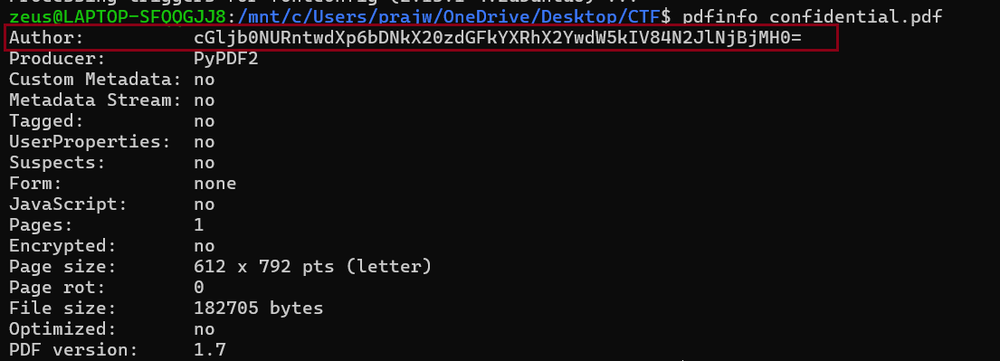
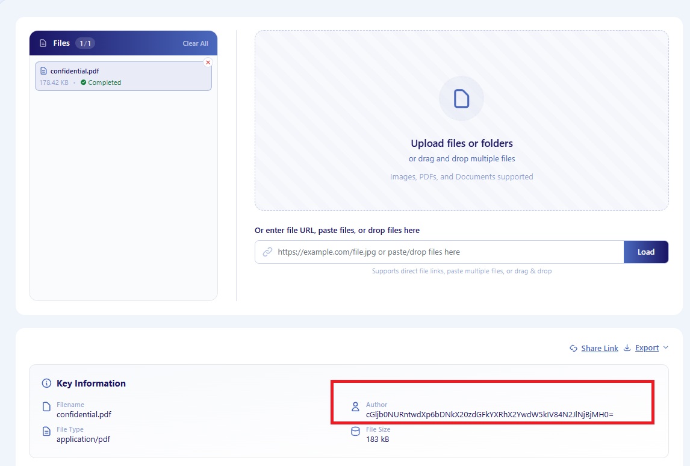
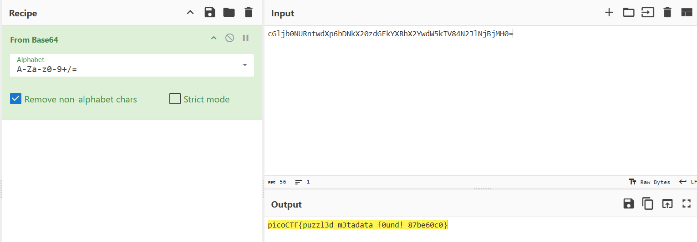

## PDF Metadata Extraction
**File:** `confidential.pdf`
**Category:** Forensics - Metadata Analysis

### Objective

A PDF titled "The Ultimate Guide to Flag Hunting" contained misleading body text explicitly claiming there was nothing to find. The goal was to determine whether the flag was hidden somewhere in the document outside the visible text.

### Approach

**Step 1 - Extract metadata with pdfinfo**

```bash
pdfinfo confidential.pdf
```



Running this immediately surfaced something unusual in the `Author` field instead of a name, it contained a long string of random-looking characters:"cGljb0NURntwdXp6bDNkX20zdGFkYXRhX2YwdW5kIV84N2JlNjBjMH0="

This stood out because every other field (`Producer`, `Tagged`, `Form`, etc.) held normal expected values, while `Author` clearly didn't belong.

**Step 2 - Confirm the finding with a metadata extraction tool**

To cross-check the result, I also ran the PDF through a metadata extraction tool, which confirmed the same string in the `Author` field:



### Identifying the Encoding

Looking at the string, it only used `A-Z`, `a-z`, `0-9`, and ended in `=` a strong indicator of **Base64** encoding (restricted character set + padding character).

### Decoding with CyberChef

To confirm and decode it, I used [CyberChef](https://gchq.github.io/CyberChef/):

1. Pasted the string into the **Input** box
2. Added the **From Base64** operation to the Recipe
3. The **Output** box immediately revealed the flag



**Output:**

picoCTF{puzzl3d_m3tadata_f0und!_87be60c0}
